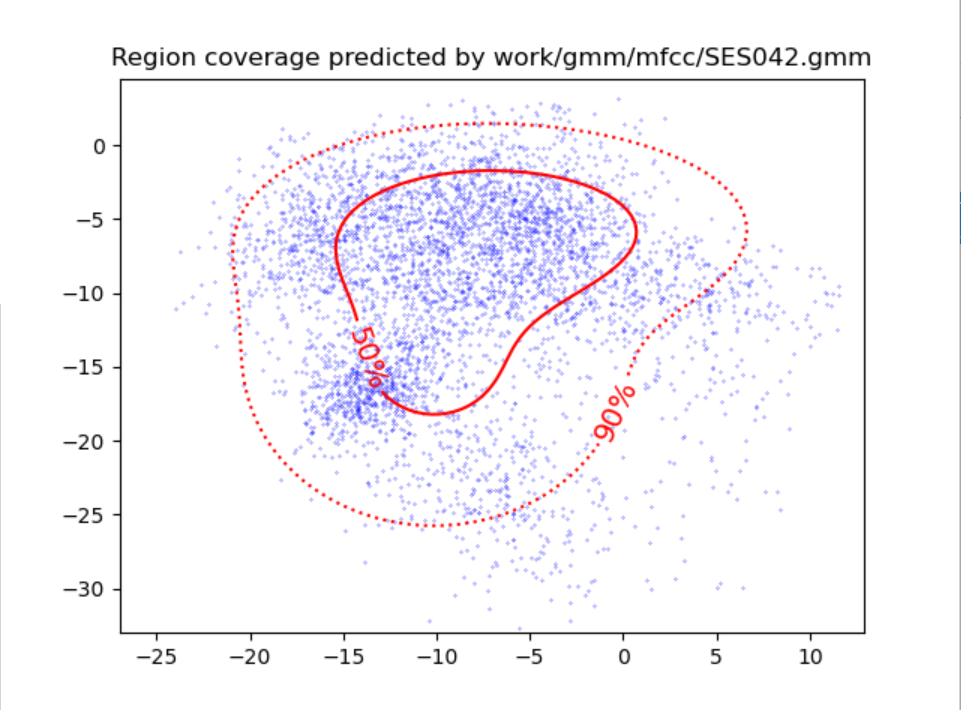

PAV - P4: reconocimiento y verificación del locutor
===================================================

Obtenga su copia del repositorio de la práctica accediendo a [Práctica 4](https://github.com/albino-pav/P4)
y pulsando sobre el botón `Fork` situado en la esquina superior derecha. A continuación, siga las
instrucciones de la [Práctica 2](https://github.com/albino-pav/P2) para crear una rama con el apellido de
los integrantes del grupo de prácticas, dar de alta al resto de integrantes como colaboradores del proyecto
y crear la copias locales del repositorio.

También debe descomprimir, en el directorio `PAV/P4`, el fichero [db_8mu.tgz](https://atenea.upc.edu/pluginfile.php/3145524/mod_assign/introattachment/0/spk_8mu.tgz?forcedownload=1)
con la base de datos oral que se utilizará en la parte experimental de la práctica.

Como entrega deberá realizar un *pull request* con el contenido de su copia del repositorio. Recuerde
que los ficheros entregados deberán estar en condiciones de ser ejecutados con sólo ejecutar:

~~~~~~~~~~~~~~~~~~~~~~~~~~~~~~~~~~~~~~~~~~~~~~~~~~~~~.sh
  make release
  run_spkid mfcc train test classerr verify verifyerr
~~~~~~~~~~~~~~~~~~~~~~~~~~~~~~~~~~~~~~~~~~~~~~~~~~~~~

Recuerde que, además de los trabajos indicados en esta parte básica, también deberá realizar un proyecto
de ampliación, del cual deberá subir una memoria explicativa a Atenea y los ficheros correspondientes al
repositorio de la práctica.

A modo de memoria de la parte básica, complete, en este mismo documento y usando el formato *markdown*, los
ejercicios indicados.

## Ejercicios.

### SPTK, Sox y los scripts de extracción de características.

- Analice el script `wav2lp.sh` y explique la misión de los distintos comandos, y sus opciones, involucrados
  en el *pipeline* principal (`sox`, `$X2X`, `$FRAME`, `$WINDOW` y `$LPC`).

  SOX: SoX (Sound eXchange) es un comando multiplataforma creado para manipular archivos de audio. Soporta la lectura y escritura en archivos con formatos como AU, WAV, AIFF, Ogg Vorbis, FLAC y MP3 (a través de LAME). También permite la reproducción y grabación de audio a través de los comandos play y rec, respectivamente.
  Si usamos el comando -h (help de ubuntu para programas) vemos todas las opciones que nos ofrece.

    

  $X2X: x2x es el programa de SPTK que permite la conversión entre distintos formatos de datos.

    

  $FRAME: Divide la señal de entrada en tramas de 200 muestras (25ms) con desplazamiento de ventana de 40 muestras (5ms) (tenga en cuenta que, en esta práctica, la frecuencia de muestreo es 8 kHz): ej. sptk frame -l 200 -p 40

    

  $WINDOW: Multiplica cada trama por la ventana de Blackman (opción por defecto): ej. sptk window -l 200

    

  $LPC: Calcula los lpc_order primeros coeficientes de predicción lineal, precedidos por el factor de ganancia del predictor: ej. sptk lpc -l 200 -m $lpc_order

    

- Explique el procedimiento seguido para obtener un fichero de formato *fmatrix* a partir de los ficheros de salida de SPTK (líneas 41 a 47 del script `wav2lp.sh`).

  A partir del fichero wav2lp.sh obtenemos toda la base de datos como .lp. Caracterizamos los parámetros para poder obtener los coeficientes LPC en una matriz que crearemos con x2x.

  * ¿Por qué es conveniente usar este formato (u otro parecido)?

  Lo utilizamos para poder identificar los coeficientes por tramas. De esta manera los tenemos ordenados y nos facilita la lectura de ellos.

- Escriba el *pipeline* principal usado para calcular los coeficientes cepstrales de predicción lineal (LPCC) en su fichero <code>scripts/wav2lpcc.sh</code>:

~~~~~~~~~~~~~~~~~~~~~~~~~~~~~~~~~~~~~~~~~~~~~~~~~~~~~~~~~~~~~~~~~~~~~~~~~~~~~~~~~~~~~~~~~~~~~~~~~.sh
sox $inputfile -t raw -e signed -b 16 - | $X2X +sf | $FRAME -l 240 -p 80 | $WINDOW -l 240 -L 240 | $LPC -l 240 -m $lpc_order | $LPCC -m $lpc_order -M $cepstrum_order > $base.lpcc
~~~~~~~~~~~~~~~~~~~~~~~~~~~~~~~~~~~~~~~~~~~~~~~~~~~~~~~~~~~~~~~~~~~~~~~~~~~~~~~~~~~~~~~~~~~~~~~~~

- Escriba el *pipeline* principal usado para calcular los coeficientes cepstrales en escala Mel (MFCC) en su fichero <code>scripts/wav2mfcc.sh</code>:

~~~~~~~~~~~~~~~~~~~~~~~~~~~~~~~~~~~~~~~~~~~~~~~~~~~~~~~~~~~~~~~~~~~~~~~~~~~~~~~~~~~~~~~~~~~~~~~~~.sh
sox $inputfile -t raw -e signed -b 16 - | $X2X +sf | $FRAME -l 240 -p 80 | $WINDOW -l 240 -L 240 | $MFCC -l 240 -m $mfcc_order -n $filters -s $frequency > $base.mfcc
~~~~~~~~~~~~~~~~~~~~~~~~~~~~~~~~~~~~~~~~~~~~~~~~~~~~~~~~~~~~~~~~~~~~~~~~~~~~~~~~~~~~~~~~~~~~~~~~~

### Extracción de características.

- Inserte una imagen mostrando la dependencia entre los coeficientes 2 y 3 de las tres parametrizaciones para una señal de prueba.

  

  
  
  

  

  
  
  

  + ¿Cuál de ellas le parece que contiene más información?

  Los coeficientes que tienen más información son los del MFCC, los cuales son más incorrelados. En las graficas anteriores imagenes se puede observar la diferencia entre los coeficientes 2-3 y 3-4 para cada uno de ellos.

- Usando el programa <code>pearson</code>, obtenga los coeficientes de correlación    normalizada entre los parámetros 2 y 3, y rellene la tabla siguiente con los valores obtenidos.

  
  
  

  |                        |    LP   |   LPCC   |   MFCC  |
  |------------------------|:-------:|:--------:|:-------:|
  | &rho;x[2,3] |-0.872284|  0.15077 |-0.205246|

  + Compare los resultados de <code>pearson</code> con los obtenidos gráficamente.

  Como vemos en la tabla, el valor de LP y MFCC es menor al de LPCC por lo que indica que estan menos correlados entre ellos asi como lo vemos también en las gráficas.

- Según la teoría, ¿qué parámetros considera adecuados para el cálculo de los    coeficientes LPCC y MFCC?

  Para LPCC:

  lpc_order=24
  cepstrum_order=24

  Para MFCC:

  mfcc_order=12
  filters=20
  frequency=8

### Entrenamiento y visualización de los GMM.

Complete el código necesario para entrenar modelos GMM.

- Inserte una gráfica que muestre la función de densidad de probabilidad modelada por el GMM de un locutor
  para sus dos primeros coeficientes de MFCC.

    Locutor 42:

    

    Locutor 107:

    

- Inserte una gráfica que permita comparar los modelos y poblaciones de dos locutores distintos (la gŕafica
  de la página 20 del enunciado puede servirle de referencia del resultado deseado). Analice la capacidad
  del modelado GMM para diferenciar las señales de uno y otro.

  Locutor 42 con su población:

  

  Locutor 107 con su población:

  

  Locutor 42 con la población del locutor 107:

  

  Locutor 107 con la población del locutor 42:

  

  Si población y locutor no coinciden, vemos que no hay coincidencia entre las regiones y las poblaciones. Es decir, la densidad no se centra en el circulo del % correspondiente. En las que si coincide, vemos con claridad que estan repartidas de manera correcta. Esto nos ayuda para diferenciar que candidatos son impostores o usuarios legítimos.

### Reconocimiento del locutor.

Complete el código necesario para realizar reconociminto del locutor y optimice sus parámetros.

- Inserte una tabla con la tasa de error obtenida en el reconocimiento de los locutores de la base de datos
  SPEECON usando su mejor sistema de reconocimiento para los parámetros LP, LPCC y MFCC.

  |       |Tasa error|
  |-------|:--------:|
  | LP    |  52.74%  |
  | LPCC  |  8.54%   |
  | MFCC  |  18.22%  |

    

### Verificación del locutor.

Complete el código necesario para realizar verificación del locutor y optimice sus parámetros.

- Inserte una tabla con el *score* obtenido con su mejor sistema de verificación del locutor en la tarea
  de verificación de SPEECON. La tabla debe incluir el umbral óptimo, el número de falsas alarmas y de
  pérdidas, y el score obtenido usando la parametrización que mejor resultado le hubiera dado en la tarea
  de reconocimiento.

    

### Test final y trabajo de ampliación.

- Recuerde adjuntar los ficheros `class_test.log` y `verif_test.log` correspondientes a la evaluación
  *ciega* final.

- Recuerde, también, enviar a Atenea un fichero en formato zip o tgz con la memoria con el trabajo
  realizado como ampliación, así como los ficheros `class_ampl.log` y/o `verif_ampl.log`, obtenidos como
  resultado del mismo.
